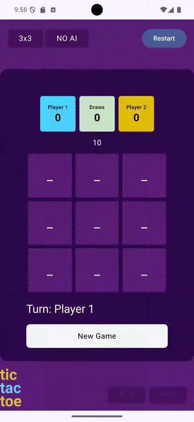

# Додати можливість вибору величини ігрового поля (не обов’язково)

# Забезпечити можливість багаторазового проведення раундів між тими ж гравцями

# Додати таймер для кожного ходу гравця

# Реалізувати кнопки керування грою

# Продемонструвати власне творче бачення гри
## Вибір символів (не лише X та O)

## Режим гри з ботом

